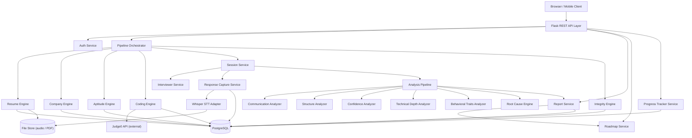

# Design Document: AI Interview Diagnostic System

## Overview

The AI Interview Diagnostic System is a Python/Flask web application that conducts AI-powered mock interviews, captures multi-dimensional response data, runs a diagnostic analysis pipeline, and produces a personalized report and improvement roadmap. The system is designed for engineering students and first-time job seekers who need deep, root-cause-level feedback rather than generic tips.

The core value proposition is the Root Cause Engine: rather than saying "improve communication", it traces a symptom (short, unclear answers) to a cause (no answering framework) to an impact (low confidence perception).

---

## Architecture

The system follows a layered architecture with clear separation between transport (HTTP), business logic (services), and data access (repositories).



### Key Architectural Decisions

- **Synchronous analysis pipeline**: For MVP, analysis runs synchronously after session completion. A task queue (Celery) can be added later for scale.
- **Adapter pattern for STT**: Whisper is wrapped behind a `SpeechToTextAdapter` interface, making it swappable for other engines.
- **Adapter pattern for code execution**: Judge0 is wrapped behind a `CodeExecutionAdapter` interface, making it swappable for self-hosted runners.
- **Dimension scores are immutable value objects**: Once computed, scores are never mutated — new score objects are created for each session.
- **Repository pattern for all data access**: Services depend on abstract repository interfaces, not SQLAlchemy models directly.
- **Pipeline Orchestrator**: A top-level `PipelineOrchestrator` service sequences the Resume → Role → Company → Aptitude → Coding → Interview → Analysis → Report flow, delegating each step to the appropriate engine/service.
- **Company configuration is data-driven**: Round configurations for each company are stored as JSON records in the database, not hard-coded, so new companies can be added without code changes.

---

## Components and Interfaces

### Auth Service

Handles registration, login, and token issuance.

```python
class AuthService:
    def register(self, email: str, password: str) -> Student
    def login(self, email: str, password: str) -> AuthToken
    def verify_token(self, token: str) -> Student
```

### Session Service

Orchestrates the lifecycle of a mock interview session.

```python
class SessionService:
    def create_session(self, student_id: str, role: str, input_mode: str, question_count: int) -> Session
    def get_session(self, session_id: str) -> Session
    def submit_response(self, session_id: str, question_id: str, audio_bytes: bytes | None, text: str | None) -> Response
    def complete_session(self, session_id: str) -> Report
```

### Interviewer Service

Generates questions using an LLM (OpenAI GPT or local model).

```python
class InterviewerService:
    def generate_opening_question(self, role: str) -> Question
    def generate_follow_up(self, role: str, previous_qa: list[QAPair]) -> Question
    def generate_pressure_question(self, role: str, context: list[QAPair]) -> Question
    def is_vague(self, response_text: str) -> bool
```

### Response Capture Service

Handles audio → transcript conversion and raw signal extraction.

```python
class ResponseCaptureService:
    def capture_voice(self, audio_bytes: bytes) -> CapturedResponse
    def capture_text(self, text: str) -> CapturedResponse
```

`CapturedResponse` contains: `transcript`, `duration_seconds`, `filler_word_count`, `pause_events: list[PauseEvent]`, `words_per_minute`.

### Speech-to-Text Adapter

```python
class SpeechToTextAdapter(Protocol):
    def transcribe(self, audio_bytes: bytes) -> TranscriptionResult
```

`WhisperAdapter` implements this protocol using `openai-whisper`.

### Analysis Pipeline

Orchestrates all five analyzers and the Root Cause Engine.

```python
class AnalysisPipeline:
    def analyze_session(self, session: Session) -> AnalysisResult
```

`AnalysisResult` contains per-response scores and aggregate dimension scores.

### Individual Analyzers

Each analyzer follows the same interface:

```python
class DimensionAnalyzer(Protocol):
    def analyze(self, response: CapturedResponse, question: Question) -> DimensionScore
```

- `CommunicationAnalyzer` — grammar, fluency, clarity
- `StructureAnalyzer` — STAR detection, coherence
- `ConfidenceAnalyzer` — voice stability, hesitation, filler density
- `TechnicalDepthAnalyzer` — keyword coverage, explanation clarity
- `BehavioralTraitsAnalyzer` — authenticity, emotional stability under pressure

### Root Cause Engine

```python
class RootCauseEngine:
    def identify_root_causes(self, analysis_result: AnalysisResult) -> list[RootCauseEntry]
```

Uses a rule-based cause library (JSON config) mapping dimension weakness patterns to cause + impact strings.

### Report Service

```python
class ReportService:
    def generate_report(self, session: Session, analysis_result: AnalysisResult) -> Report
    def get_report(self, report_id: str) -> Report
```

### Roadmap Service

```python
class RoadmapService:
    def generate_roadmap(self, report: Report) -> Roadmap
    def get_roadmap(self, roadmap_id: str) -> Roadmap
```

### Progress Tracker Service

```python
class ProgressTrackerService:
    def get_progress(self, student_id: str) -> ProgressData
```

`ProgressData` contains: `readiness_score_series`, `dimension_score_series`, `improvements`, `declines`.

### Pipeline Orchestrator

Sequences the full hiring simulation flow for a Student.

```python
class PipelineOrchestrator:
    def start_pipeline(self, student_id: str, resume_id: str, company_id: str, role: str) -> PipelineState
    def get_pipeline_state(self, pipeline_id: str) -> PipelineState
    def advance_step(self, pipeline_id: str) -> PipelineState
    def abandon_pipeline(self, pipeline_id: str) -> None
```

`PipelineState` contains: `pipeline_id`, `student_id`, `current_step`, `completed_steps`, `company_id`, `role`.

### Resume Engine

Parses PDF resumes, extracts skills, and maps them to suggested roles.

```python
class ResumeEngine:
    def upload_resume(self, student_id: str, pdf_bytes: bytes, filename: str) -> Resume
    def extract_skills(self, resume_text: str) -> list[str]
    def suggest_roles(self, skills: list[str]) -> list[RoleSuggestion]
```

`RoleSuggestion` contains: `role`, `confidence_score` (0.0–1.0).

The skill-to-role mapping is stored as a JSON config file. Example rules:
- `{Python, Machine Learning}` → Data Analyst, Data Scientist
- `{Java, DSA}` → Software Engineer
- `{SQL, Data Analysis}` → Data Analyst

### Company Engine

Stores and retrieves company-specific round configurations.

```python
class CompanyEngine:
    def list_companies(self) -> list[Company]
    def get_company(self, company_id: str) -> Company
    def get_round_sequence(self, company_id: str) -> list[RoundConfig]
```

`RoundConfig` contains: `round_type` ("aptitude" | "coding" | "interview"), `config` (round-specific parameters).

### Aptitude Engine

Manages timed MCQ sessions, navigation state, and scoring.

```python
class AptitudeEngine:
    def start_round(self, student_id: str, company_id: str) -> AptitudeRound
    def get_question(self, round_id: str, question_index: int) -> AptitudeQuestion
    def record_answer(self, round_id: str, question_id: str, selected_option: str) -> AptitudeRound
    def skip_question(self, round_id: str, question_id: str) -> AptitudeRound
    def get_summary(self, round_id: str) -> AptitudeSummary
    def submit_round(self, round_id: str) -> AptitudeResult
    def auto_submit(self, round_id: str) -> AptitudeResult
```

`AptitudeSummary` contains: `attempted_count`, `skipped_count`, `not_visited_count`.

### Coding Engine

Presents coding problems, executes submissions via Judge0, and evaluates results.

```python
class CodingEngine:
    def start_round(self, student_id: str, company_id: str) -> CodingRound
    def get_problem(self, round_id: str, problem_index: int) -> CodingProblem
    def submit_code(self, round_id: str, submission: CodeSubmission) -> CodeResult
```

```python
class CodeExecutionAdapter(Protocol):
    def execute(self, source_code: str, language: str, stdin: str) -> ExecutionResult
```

`Judge0Adapter` implements `CodeExecutionAdapter` by calling the Judge0 REST API.

`ExecutionResult` contains: `stdout`, `stderr`, `status` ("accepted" | "wrong_answer" | "time_limit_exceeded" | "runtime_error" | "compilation_error"), `time_ms`.

### Integrity Engine

Monitors anti-cheat signals and computes the Trust Score.

```python
class IntegrityEngine:
    def log_event(self, session_id: str, event: ActivityEvent) -> None
    def compute_trust_score(self, session_id: str) -> TrustScore
```

`ActivityEvent` contains: `event_type` ("tab_switch" | "paste" | "burst_typing" | "face_anomaly"), `timestamp`, `metadata: dict`.

Trust Score formula (weights are configurable via JSON config):
- Tab switch penalty: each switch reduces score by a configured amount (default 5 pts, capped at 30 pts total)
- Paste event penalty: each paste reduces score by a configured amount (default 10 pts, capped at 30 pts total)
- Burst typing ratio penalty: proportional reduction based on ratio of burst keystrokes to total keystrokes
- Face anomaly ratio penalty: proportional reduction based on ratio of anomalous frames to total frames

---

## Data Models

### Student

```python
@dataclass(frozen=True)
class Student:
    id: str
    email: str
    password_hash: str
    created_at: datetime
```

### Session

```python
@dataclass(frozen=True)
class Session:
    id: str
    student_id: str
    role: str                    # e.g. "software_engineer"
    input_mode: str              # "voice" | "text"
    question_count: int          # 5–15
    status: str                  # "in_progress" | "completed"
    started_at: datetime
    completed_at: datetime | None
    questions: tuple[Question, ...]
    responses: tuple[CapturedResponse, ...]
```

### Question

```python
@dataclass(frozen=True)
class Question:
    id: str
    session_id: str
    text: str
    question_type: str           # "opening" | "follow_up" | "pressure" | "clarifying"
    is_technical: bool
    expected_concepts: tuple[str, ...]  # for technical questions
    presented_at: datetime
```

### CapturedResponse

```python
@dataclass(frozen=True)
class CapturedResponse:
    id: str
    session_id: str
    question_id: str
    transcript: str
    duration_seconds: float
    filler_word_count: int
    pause_events: tuple[PauseEvent, ...]
    words_per_minute: float
    captured_at: datetime
```

### PauseEvent

```python
@dataclass(frozen=True)
class PauseEvent:
    start_offset_seconds: float
    duration_seconds: float
```

### DimensionScore

```python
@dataclass(frozen=True)
class DimensionScore:
    dimension: str               # "communication" | "structure" | "confidence" | "technical" | "behavioral"
    score: float                 # 0.0–100.0
    sub_scores: dict[str, float] # e.g. {"grammar": 72.0, "fluency": 65.0, "clarity": 80.0}
```

### AnalysisResult

```python
@dataclass(frozen=True)
class AnalysisResult:
    session_id: str
    per_response_scores: tuple[tuple[DimensionScore, ...], ...]
    aggregate_scores: tuple[DimensionScore, ...]
    root_causes: tuple[RootCauseEntry, ...]
```

### RootCauseEntry

```python
@dataclass(frozen=True)
class RootCauseEntry:
    symptom: str
    cause: str
    impact: str
    severity: float              # 0.0–1.0, used for ordering
    dimension: str
```

### Report

```python
@dataclass(frozen=True)
class Report:
    id: str
    session_id: str
    student_id: str
    readiness_score: float       # 0.0–100.0
    dimension_scores: tuple[DimensionScore, ...]
    root_causes: tuple[RootCauseEntry, ...]
    recommendations: tuple[str, ...]  # 3–5 items
    generated_at: datetime
```

### Roadmap

```python
@dataclass(frozen=True)
class Roadmap:
    id: str
    report_id: str
    student_id: str
    days: tuple[RoadmapDay, ...]
    generated_at: datetime
```

### RoadmapDay

```python
@dataclass(frozen=True)
class RoadmapDay:
    day_number: int
    practice_type: str
    description: str
    estimated_minutes: int
    target_dimension: str
```

### ProgressData

```python
@dataclass(frozen=True)
class ProgressData:
    student_id: str
    sessions: tuple[SessionSummary, ...]
    readiness_score_series: tuple[float, ...]
    dimension_score_series: dict[str, tuple[float, ...]]
    improved_dimensions: tuple[str, ...]   # improved >= 10 pts
    declined_dimensions: tuple[str, ...]   # declined >= 5 pts
```

### Resume

```python
@dataclass(frozen=True)
class Resume:
    id: str
    student_id: str
    file_path: str
    extracted_text: str
    skills: tuple[str, ...]
    suggested_roles: tuple[RoleSuggestion, ...]
    uploaded_at: datetime
```

### RoleSuggestion

```python
@dataclass(frozen=True)
class RoleSuggestion:
    role: str
    confidence_score: float   # 0.0–1.0
```

### Company

```python
@dataclass(frozen=True)
class Company:
    id: str
    name: str                          # e.g. "TCS", "Google"
    rounds: tuple[RoundConfig, ...]    # ordered sequence of rounds
```

### RoundConfig

```python
@dataclass(frozen=True)
class RoundConfig:
    round_type: str          # "aptitude" | "coding" | "interview"
    question_count: int
    difficulty: str          # "easy" | "medium" | "hard"
    time_limit_minutes: int | None
```

### AptitudeQuestion

```python
@dataclass(frozen=True)
class AptitudeQuestion:
    id: str
    company_id: str
    text: str
    options: tuple[str, ...]    # exactly 4 options
    correct_option: str         # one of the options
    topic: str
```

### AptitudeRound

```python
@dataclass(frozen=True)
class AptitudeRound:
    id: str
    student_id: str
    company_id: str
    questions: tuple[AptitudeQuestion, ...]
    question_statuses: dict[str, str]   # question_id → "not_visited" | "attempted" | "skipped"
    selected_options: dict[str, str]    # question_id → selected option
    started_at: datetime
    time_limit_seconds: int
    submitted: bool
```

### AptitudeResult

```python
@dataclass(frozen=True)
class AptitudeResult:
    round_id: str
    student_id: str
    correct_count: int
    wrong_count: int
    skipped_count: int
    total_questions: int
    score_percentage: float   # (correct_count / total_questions) * 100
    evaluated_at: datetime
```

### CodingProblem

```python
@dataclass(frozen=True)
class CodingProblem:
    id: str
    company_id: str
    title: str
    description: str
    difficulty: str                          # "easy" | "medium" | "hard"
    visible_test_cases: tuple[TestCase, ...]
    hidden_test_cases: tuple[TestCase, ...]  # not exposed to client
    time_limit_ms: int
    memory_limit_kb: int
```

### TestCase

```python
@dataclass(frozen=True)
class TestCase:
    id: str
    stdin: str
    expected_stdout: str
```

### CodeSubmission

```python
@dataclass(frozen=True)
class CodeSubmission:
    id: str
    student_id: str
    problem_id: str
    source_code: str
    language: str          # "python" | "java" | "cpp"
    submitted_at: datetime
    attempt_number: int
```

### CodeResult

```python
@dataclass(frozen=True)
class CodeResult:
    submission_id: str
    visible_results: tuple[TestCaseResult, ...]
    hidden_pass_count: int
    hidden_total_count: int
    score_percentage: float   # (total_passed / total_test_cases) * 100
    time_taken_seconds: float
    evaluated_at: datetime
```

### TestCaseResult

```python
@dataclass(frozen=True)
class TestCaseResult:
    test_case_id: str
    passed: bool
    actual_stdout: str
    status: str   # "accepted" | "wrong_answer" | "time_limit_exceeded" | "runtime_error" | "compilation_error"
```

### ActivityEvent

```python
@dataclass(frozen=True)
class ActivityEvent:
    id: str
    session_id: str
    event_type: str    # "tab_switch" | "paste" | "burst_typing" | "face_anomaly"
    timestamp: datetime
    metadata: dict[str, object]
```

### TrustScore

```python
@dataclass(frozen=True)
class TrustScore:
    session_id: str
    score: float                    # 0.0–100.0
    tab_switch_count: int
    paste_event_count: int
    burst_typing_ratio: float       # 0.0–1.0
    face_anomaly_ratio: float       # 0.0–1.0
    integrity_flagged: bool         # True if score < 50
    computed_at: datetime
```

### PipelineState

```python
@dataclass(frozen=True)
class PipelineState:
    pipeline_id: str
    student_id: str
    company_id: str
    role: str
    current_step: str    # "resume" | "role" | "company" | "aptitude" | "coding" | "interview" | "analysis" | "report"
    completed_steps: tuple[str, ...]
    resume_id: str | None
    aptitude_round_id: str | None
    coding_round_id: str | None
    session_id: str | None
    report_id: str | None
    started_at: datetime
    last_updated_at: datetime
```

---

## Database Schema

The following tables extend the existing `users`, `sessions`, `responses`, and `analysis` tables.

```sql
-- Resume storage
CREATE TABLE resumes (
    id          UUID PRIMARY KEY,
    student_id  UUID NOT NULL REFERENCES users(id) ON DELETE CASCADE,
    file_path   TEXT NOT NULL,
    text        TEXT NOT NULL,
    skills      JSONB NOT NULL DEFAULT '[]',
    suggested_roles JSONB NOT NULL DEFAULT '[]',
    uploaded_at TIMESTAMPTZ NOT NULL DEFAULT NOW()
);

-- Company catalogue (data-driven, not hard-coded)
CREATE TABLE companies (
    id     UUID PRIMARY KEY,
    name   TEXT NOT NULL UNIQUE,
    rounds JSONB NOT NULL   -- ordered array of RoundConfig objects
);

-- Aptitude question bank
CREATE TABLE aptitude_questions (
    id             UUID PRIMARY KEY,
    company_id     UUID NOT NULL REFERENCES companies(id),
    text           TEXT NOT NULL,
    options        JSONB NOT NULL,   -- array of 4 strings
    correct_option TEXT NOT NULL,
    topic          TEXT NOT NULL
);

-- Per-round aptitude state
CREATE TABLE aptitude_rounds (
    id                 UUID PRIMARY KEY,
    student_id         UUID NOT NULL REFERENCES users(id),
    company_id         UUID NOT NULL REFERENCES companies(id),
    question_statuses  JSONB NOT NULL DEFAULT '{}',
    selected_options   JSONB NOT NULL DEFAULT '{}',
    started_at         TIMESTAMPTZ NOT NULL DEFAULT NOW(),
    time_limit_seconds INT NOT NULL,
    submitted          BOOLEAN NOT NULL DEFAULT FALSE
);

-- Aptitude evaluation results
CREATE TABLE aptitude_results (
    id               UUID PRIMARY KEY,
    round_id         UUID NOT NULL REFERENCES aptitude_rounds(id),
    student_id       UUID NOT NULL REFERENCES users(id),
    correct_count    INT NOT NULL,
    wrong_count      INT NOT NULL,
    skipped_count    INT NOT NULL,
    total_questions  INT NOT NULL,
    score_percentage NUMERIC(5,2) NOT NULL,
    evaluated_at     TIMESTAMPTZ NOT NULL DEFAULT NOW()
);

-- Code submissions
CREATE TABLE code_submissions (
    id             UUID PRIMARY KEY,
    student_id     UUID NOT NULL REFERENCES users(id),
    problem_id     UUID NOT NULL,
    source_code    TEXT NOT NULL,
    language       TEXT NOT NULL,
    submitted_at   TIMESTAMPTZ NOT NULL DEFAULT NOW(),
    attempt_number INT NOT NULL
);

-- Code evaluation results
CREATE TABLE code_results (
    id                  UUID PRIMARY KEY,
    submission_id       UUID NOT NULL REFERENCES code_submissions(id),
    visible_results     JSONB NOT NULL DEFAULT '[]',
    hidden_pass_count   INT NOT NULL,
    hidden_total_count  INT NOT NULL,
    score_percentage    NUMERIC(5,2) NOT NULL,
    time_taken_seconds  NUMERIC(8,3) NOT NULL,
    evaluated_at        TIMESTAMPTZ NOT NULL DEFAULT NOW()
);

-- Integrity / anti-cheat event log
CREATE TABLE activity_logs (
    id          UUID PRIMARY KEY,
    session_id  UUID NOT NULL,
    event_type  TEXT NOT NULL,   -- "tab_switch" | "paste" | "burst_typing" | "face_anomaly"
    timestamp   TIMESTAMPTZ NOT NULL,
    metadata    JSONB NOT NULL DEFAULT '{}'
);

-- Computed trust scores
CREATE TABLE trust_scores (
    id                  UUID PRIMARY KEY,
    session_id          UUID NOT NULL UNIQUE,
    score               NUMERIC(5,2) NOT NULL,
    tab_switch_count    INT NOT NULL,
    paste_event_count   INT NOT NULL,
    burst_typing_ratio  NUMERIC(5,4) NOT NULL,
    face_anomaly_ratio  NUMERIC(5,4) NOT NULL,
    integrity_flagged   BOOLEAN NOT NULL,
    computed_at         TIMESTAMPTZ NOT NULL DEFAULT NOW()
);

-- Pipeline orchestration state
CREATE TABLE pipeline_states (
    pipeline_id      UUID PRIMARY KEY,
    student_id       UUID NOT NULL REFERENCES users(id),
    company_id       UUID NOT NULL REFERENCES companies(id),
    role             TEXT NOT NULL,
    current_step     TEXT NOT NULL,
    completed_steps  JSONB NOT NULL DEFAULT '[]',
    resume_id        UUID REFERENCES resumes(id),
    aptitude_round_id UUID REFERENCES aptitude_rounds(id),
    coding_round_id  UUID,
    session_id       UUID,
    report_id        UUID,
    started_at       TIMESTAMPTZ NOT NULL DEFAULT NOW(),
    last_updated_at  TIMESTAMPTZ NOT NULL DEFAULT NOW()
);
```

---

## Correctness Properties

A property is a characteristic or behavior that should hold true across all valid executions of a system — essentially, a formal statement about what the system should do. Properties serve as the bridge between human-readable specifications and machine-verifiable correctness guarantees.


### Property 1: Registration round-trip
*For any* unique email and password, registering a student and then logging in with those credentials should return a valid authentication token.
**Validates: Requirements 1.1, 1.3**

### Property 2: Duplicate email rejection
*For any* email address that has already been registered, attempting to register again with that email should return an error.
**Validates: Requirements 1.2**

### Property 3: Invalid login does not reveal field
*For any* combination of unregistered email or wrong password, the login error response should not indicate which specific field is incorrect.
**Validates: Requirements 1.4**

### Property 4: Invalid role rejection
*For any* session creation request with a role string not in the predefined role list, the system should reject the request with a validation error.
**Validates: Requirements 1.5**

### Property 5: Session always contains a pressure question
*For any* completed session regardless of role or question count, the session's question list should contain at least one question with type "pressure".
**Validates: Requirements 2.3**

### Property 6: Session question count is within configured bounds
*For any* completed session configured with question_count N (where 5 ≤ N ≤ 15), the total number of questions presented should equal N.
**Validates: Requirements 2.5**

### Property 7: Text transcript identity
*For any* text input string, capturing it as a text-mode response should produce a CapturedResponse whose transcript equals the original input string exactly.
**Validates: Requirements 3.2**

### Property 8: Response duration is non-negative
*For any* captured response, the computed duration_seconds should be greater than or equal to zero.
**Validates: Requirements 3.3**

### Property 9: Filler word count is consistent with transcript
*For any* transcript string with a known set of filler words, the detected filler_word_count should equal the actual count of filler tokens in that transcript.
**Validates: Requirements 3.4**

### Property 10: All dimension scores are in range [0, 100]
*For any* captured response and question, every DimensionScore produced by any analyzer should have a score value in the closed interval [0.0, 100.0].
**Validates: Requirements 4.4, 5.4, 6.3, 7.4, 8.3**

### Property 11: Aggregate dimension score equals mean of per-response scores
*For any* session with N responses, the aggregate DimensionScore for each dimension should equal the arithmetic mean of the N per-response scores for that dimension.
**Validates: Requirements 4.5, 5.5, 6.5, 7.5, 8.4**

### Property 12: Higher filler density yields lower fluency score
*For any* two transcripts of equal length where transcript A has more filler words than transcript B, the fluency sub-score for A should be less than or equal to the fluency score for B.
**Validates: Requirements 4.2**

### Property 13: STAR structure score is monotone in component count
*For any* two behavioral responses where response A contains more STAR components than response B, the structure sub-score for A should be greater than or equal to the structure sub-score for B.
**Validates: Requirements 5.2**

### Property 14: Technical Depth omitted for non-technical roles
*For any* session with a non-technical role (e.g., "hr"), the generated Report should not contain a DimensionScore with dimension "technical".
**Validates: Requirements 7.6**

### Property 15: Keyword coverage correctness sub-score is proportional
*For any* technical question with K expected concepts, a response mentioning M of those concepts should receive a correctness sub-score of M/K × 100.
**Validates: Requirements 7.2**

### Property 16: Root cause count is between 1 and 3, ordered by severity descending
*For any* completed analysis result, the list of root cause entries should have length between 1 and 3 inclusive, and entries should be ordered so that severity values are non-increasing.
**Validates: Requirements 9.4**

### Property 17: Primary weakness is the lowest-scoring dimension
*For any* analysis result, the dimension identified as the primary weakness should be the one with the minimum aggregate score among all applicable dimensions.
**Validates: Requirements 9.1**

### Property 18: Every root cause entry has a non-empty impact statement
*For any* root cause entry produced by the Root Cause Engine, the impact field should be a non-empty string.
**Validates: Requirements 9.3**

### Property 19: Readiness score is a weighted average of dimension scores
*For any* report, the readiness_score should equal the weighted average of the applicable dimension scores using the specified weights (Communication 25%, Structure 25%, Confidence 20%, Technical 20% if applicable, Behavioral 10%, with proportional redistribution when Technical is omitted).
**Validates: Requirements 10.2**

### Property 20: Report recommendation count is between 3 and 5
*For any* generated report, the recommendations tuple should have length between 3 and 5 inclusive.
**Validates: Requirements 10.3**

### Property 21: Report persistence round-trip
*For any* generated report, saving it and then retrieving it by ID should return an equivalent Report object.
**Validates: Requirements 10.4**

### Property 22: Roadmap day count is within bounds based on weak dimension count
*For any* report where W dimensions score below 60, the generated roadmap should span between 7 and 30 days, with longer roadmaps for higher W.
**Validates: Requirements 11.3**

### Property 23: Roadmap tasks ordered by dimension weakness priority
*For any* roadmap, the day entries targeting the weakest dimension (lowest score) should appear before day entries targeting stronger dimensions.
**Validates: Requirements 11.2**

### Property 24: Each roadmap day has a practice type and estimated duration
*For any* roadmap, every RoadmapDay entry should have a non-empty practice_type string and an estimated_minutes value greater than zero.
**Validates: Requirements 11.4**

### Property 25: Progress series length equals session count
*For any* student with N completed sessions, the readiness_score_series in ProgressData should have exactly N elements.
**Validates: Requirements 12.1**

### Property 26: Improvement highlighting threshold
*For any* student's progress data, a dimension should appear in improved_dimensions if and only if its score in the most recent session minus its score in the second-most-recent session is greater than or equal to 10.
**Validates: Requirements 12.3**

### Property 27: Decline highlighting threshold
*For any* student's progress data, a dimension should appear in declined_dimensions if and only if its score in the second-most-recent session minus its score in the most recent session is greater than or equal to 5.
**Validates: Requirements 12.4**

### Property 28: Session list ordering
*For any* student with multiple sessions, retrieving the session list should return sessions ordered by started_at descending (most recent first).
**Validates: Requirements 13.3**

### Property 29: Report JSON serialization round-trip
*For any* valid Report object, serializing it to JSON and then deserializing the result should produce an object equivalent to the original.
**Validates: Requirements 14.3**

### Property 30: Roadmap JSON serialization round-trip
*For any* valid Roadmap object, serializing it to JSON and then deserializing the result should produce an object equivalent to the original.
**Validates: Requirements 14.4, 14.5**

### Property 31: Resume skill extraction is a subset of recognized skill vocabulary
*For any* resume text, every skill returned by `extract_skills` should be a member of the predefined recognized-skill vocabulary.
**Validates: Requirements 15.2**

### Property 32: Role suggestion count is within bounds
*For any* non-empty skills list, the number of suggested roles returned by `suggest_roles` should be between 1 and 5 inclusive.
**Validates: Requirements 15.4**

### Property 33: Role suggestion confidence scores are ordered descending
*For any* skills list, the RoleSuggestion list returned by `suggest_roles` should be ordered so that confidence_score values are non-increasing.
**Validates: Requirements 15.4**

### Property 34: Resume serialization round-trip
*For any* valid Resume object, serializing it to JSON and then deserializing the result should produce an object equivalent to the original.
**Validates: Requirements 15.7**

### Property 35: Company round sequence is non-empty
*For any* company in the catalogue, `get_round_sequence` should return a list containing at least one RoundConfig.
**Validates: Requirements 16.2**

### Property 36: Aptitude round question statuses cover all questions
*For any* AptitudeRound, the set of keys in `question_statuses` should equal the set of question IDs in the `questions` tuple.
**Validates: Requirements 17.2**

### Property 37: Aptitude answer recording marks question as attempted
*For any* AptitudeRound and any question in that round, calling `record_answer` with a valid option should return a new AptitudeRound where that question's status is "attempted" and the selected option is recorded.
**Validates: Requirements 17.3**

### Property 38: Aptitude skip marks question as skipped
*For any* AptitudeRound and any question in that round, calling `skip_question` should return a new AptitudeRound where that question's status is "skipped".
**Validates: Requirements 17.4**

### Property 39: Aptitude result counts are consistent
*For any* AptitudeResult, `correct_count + wrong_count + skipped_count` should equal `total_questions`.
**Validates: Requirements 17.8**

### Property 40: Aptitude score percentage matches correct count
*For any* AptitudeResult, `score_percentage` should equal `(correct_count / total_questions) * 100`.
**Validates: Requirements 17.8**

### Property 41: Aptitude result serialization round-trip
*For any* valid AptitudeResult object, serializing it to JSON and then deserializing the result should produce an object equivalent to the original.
**Validates: Requirements 17.8**

### Property 42: Code result score percentage matches pass counts
*For any* CodeResult, `score_percentage` should equal `(visible_passed + hidden_pass_count) / (len(visible_results) + hidden_total_count) * 100`.
**Validates: Requirements 18.4**

### Property 43: Hidden test case details are not exposed in CodeResult
*For any* CodeResult returned to the client, the `visible_results` tuple should contain only results for visible test cases, and individual hidden test case pass/fail details should not be present.
**Validates: Requirements 18.5**

### Property 44: Code submission attempt number is monotonically increasing
*For any* sequence of CodeSubmissions for the same problem by the same student, each successive submission's `attempt_number` should be exactly one greater than the previous.
**Validates: Requirements 18.6**

### Property 45: Trust score is in range [0, 100]
*For any* completed session, the Trust_Score computed by the Integrity Engine should have a score value in the closed interval [0.0, 100.0].
**Validates: Requirements 19.5**

### Property 46: Trust score integrity flag is set when score is below 50
*For any* TrustScore, `integrity_flagged` should be True if and only if `score` is strictly less than 50.
**Validates: Requirements 19.7**

### Property 47: Trust score decreases monotonically with more integrity violations
*For any* two activity log sets A and B where A is a strict superset of B (A has all events in B plus at least one additional violation event), the Trust_Score computed from A should be less than or equal to the Trust_Score computed from B.
**Validates: Requirements 19.5**

### Property 48: TrustScore serialization round-trip
*For any* valid TrustScore object, serializing it to JSON and then deserializing the result should produce an object equivalent to the original.
**Validates: Requirements 19.8**

### Property 49: Pipeline completed steps are a prefix of the full step sequence
*For any* PipelineState, the `completed_steps` tuple should be a contiguous prefix of the canonical step sequence (resume → role → company → aptitude → coding → interview → analysis → report).
**Validates: Requirements 20.4**

### Property 50: Pipeline current step follows all completed steps
*For any* PipelineState, `current_step` should be the step immediately following the last entry in `completed_steps`, or the first step if `completed_steps` is empty.
**Validates: Requirements 20.4**

---

## Error Handling

### Authentication Errors
- `401 Unauthorized` — invalid or expired token
- `409 Conflict` — email already registered
- `400 Bad Request` — missing required fields

### Session Errors
- `400 Bad Request` — invalid role or input_mode
- `404 Not Found` — session or question not found
- `409 Conflict` — response submitted for already-answered question
- `408 Request Timeout` — response timeout recorded, session advances

### STT Errors
- `503 Service Unavailable` — Whisper transcription failed; client receives retry prompt
- After one failed retry, the response is recorded as empty transcript with a `stt_failed` flag

### Analysis Errors
- If any single analyzer raises an exception, the pipeline logs the error, assigns a score of 0 for that dimension, and continues. The report is still generated with a warning flag.
- If the Root Cause Engine cannot find a matching cause in the library, it falls back to a generic entry: symptom = dimension name, cause = "insufficient data", impact = "unable to determine".

### Resume Engine Errors
- `400 Bad Request` — uploaded file is not a PDF or exceeds 5 MB
- `422 Unprocessable Entity` — PDF text extraction produced empty content
- If no recognized skills are found, the engine returns an empty skills list and a default role suggestion set without raising an error.

### Company Engine Errors
- `404 Not Found` — requested company ID does not exist in the catalogue
- `409 Conflict` — attempt to modify a company configuration while a session using that company is in progress

### Aptitude Engine Errors
- `404 Not Found` — round ID or question ID not found
- `409 Conflict` — attempt to answer a question in a round that has already been submitted
- `408 Request Timeout` — timer expired; `auto_submit` is called automatically by the server

### Coding Engine Errors
- `503 Service Unavailable` — Judge0 API is unreachable or returned a timeout; client is notified and may resubmit without consuming an attempt
- `400 Bad Request` — unsupported language submitted
- Compilation errors and runtime errors from Judge0 are surfaced to the client as-is with the `status` field set accordingly.

### Integrity Engine Errors
- Integrity events are best-effort: if event logging fails (e.g., database write error), the failure is logged server-side but does not interrupt the active session.
- If Trust Score computation fails due to missing data, the score defaults to 100 with a `computation_failed` flag in the TrustScore record.

### Data Errors
- All repository operations use parameterized queries to prevent SQL injection.
- All JSON deserialization validates against Pydantic schemas before use.
- Foreign key violations return `404 Not Found` to the client.

---

## Testing Strategy

### Dual Testing Approach

Both unit tests and property-based tests are required. They are complementary:
- Unit tests catch concrete bugs with specific examples and edge cases.
- Property tests verify universal correctness across all valid inputs.

### Property-Based Testing

Library: **Hypothesis** (Python)

Each property test must run a minimum of 100 iterations (configured via `@settings(max_examples=100)`).

Each test must be tagged with a comment referencing the design property:
```python
# Feature: ai-interview-diagnostic, Property N: <property_text>
```

Each correctness property listed above must be implemented as exactly one Hypothesis property test.

Key strategies:
- Use `hypothesis.strategies` to generate `CapturedResponse`, `Session`, `Report`, `Roadmap`, and `AnalysisResult` objects with valid random data.
- Use `assume()` to filter invalid combinations (e.g., sessions with zero responses).
- For serialization round-trips (Properties 29, 30), generate arbitrary model instances and verify `deserialize(serialize(x)) == x`.

### Unit Testing

Framework: **pytest**

Focus areas:
- Specific score computation examples (e.g., a transcript with exactly 3 filler words in 30 words → fluency sub-score = specific value)
- Edge cases: empty transcript, zero-length response, all STAR components present, no STAR components
- Error conditions: STT failure retry, invalid role rejection, duplicate email
- Integration points: SessionService → AnalysisPipeline → ReportService flow

### Coverage Target

Minimum 80% line coverage enforced via `pytest-cov`. Coverage report generated on every CI run.

### Test File Organization

```
tests/
  unit/
    test_auth_service.py
    test_response_capture.py
    test_communication_analyzer.py
    test_structure_analyzer.py
    test_confidence_analyzer.py
    test_technical_depth_analyzer.py
    test_behavioral_traits_analyzer.py
    test_root_cause_engine.py
    test_report_service.py
    test_roadmap_service.py
    test_progress_tracker.py
    test_serialization.py
    test_resume_engine.py
    test_company_engine.py
    test_aptitude_engine.py
    test_coding_engine.py
    test_integrity_engine.py
    test_pipeline_orchestrator.py
  property/
    test_properties.py          # all 50 Hypothesis property tests (Properties 1–50)
  integration/
    test_session_flow.py
    test_api_endpoints.py
    test_pipeline_flow.py       # end-to-end pipeline: resume → report
    test_judge0_adapter.py      # integration with Judge0 (uses sandbox/mock)
```
